# Fundamentos de algoritmos - Parte 1

### Que es un algoritmo? 

### Clasificacion de algoritmos 

##### Algoritmos deterministas
- son algoritmos que son completamente predictivos
- Si se conocen las entradas del algoritmo siempre producira la misma salida, y la maquina interna pasara por la misma secuencia de estados en un tiempo determinado 

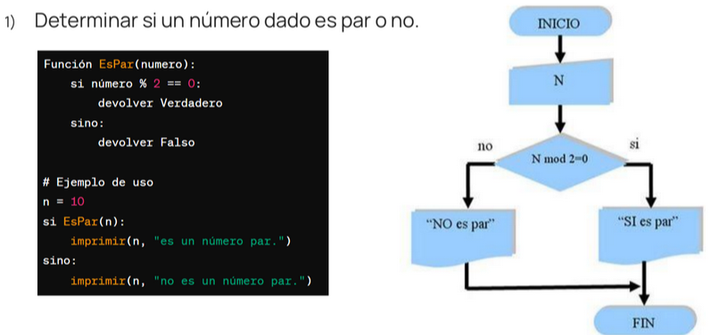

##### Algoritmos probabilistas
- Son aquellos que basan su resultado en la toma de algunas desiciones al azar, de tal forma que, en promedio, obtiene una buena solucion al problema planteado
- Ademas, a partir de unos mismos datos se puede obtener distintas soluciones y, en algunos casos, soluciones erroneas

#### Clasificacion de algoritmos probabilistas
##### algoritmos numericos 
- Los algoritmos numéricos proporcionan una solución aproximada del
problema dado.

- Los algoritmos numéricos siempre nos proporcionan un resultado y
este siempre es correcto, ya sea con mayor o menor precisión, pero
correcto al fin.

- Ayudan a resolver problemas matemáticos, de ingeniería y científicos en una computadora, automatizando el cálculo de los valores para obtener mejores aproximaciones .

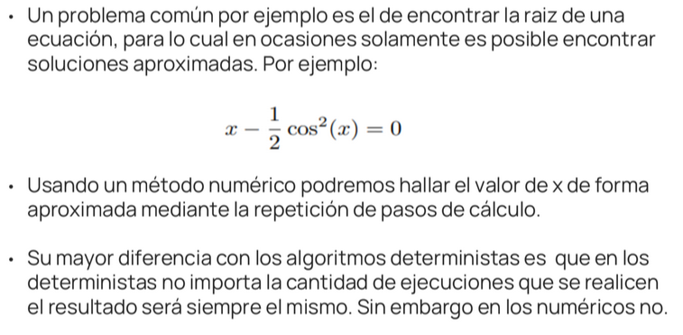

#####  algoritmos de Montecarlo
- Los algoritmos de Montecarlo siempre nos proporcionan una respuesta, sin embargo esta no siempre es correcta.
- Las respuestas erróneas tienen una baja probabilidad de ser devueltas.
- Para su desarrollo se busca minimizar la probabilidad de obtener un resultado
incorrecto.

##### Algoritmos de las vegas
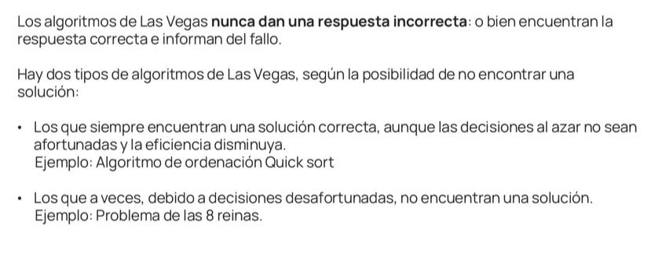

### Recursion 
Es cuando una entidad, concepto, problema o una solución a un  roblema se define en terminos de si mismo.

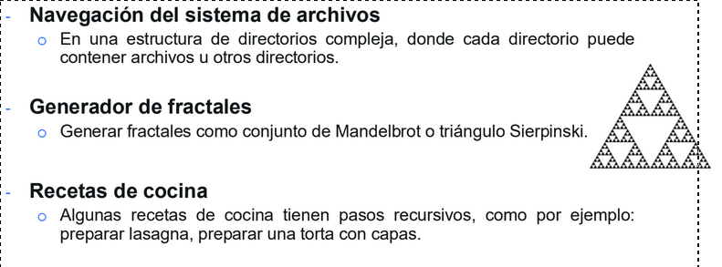

Carcateristicas deun algoritmo recursivo

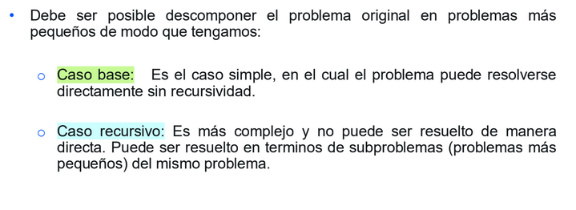

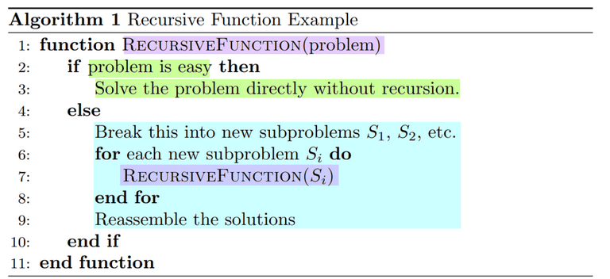

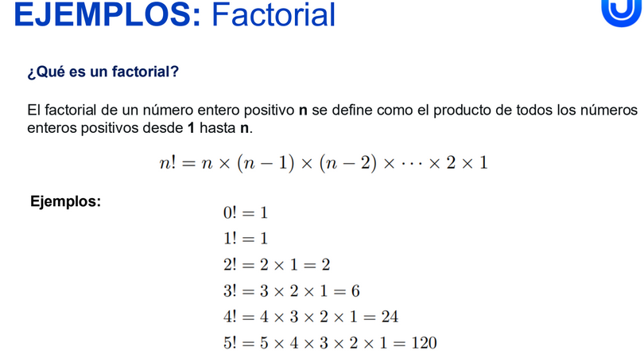

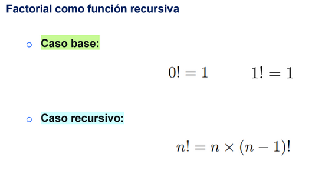

Modelo de ejecucion 
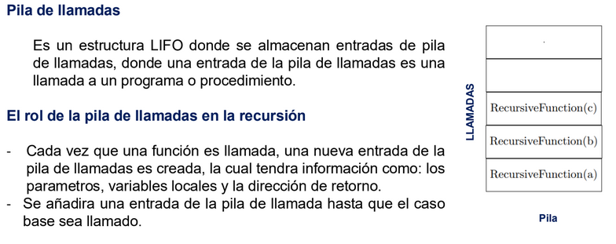

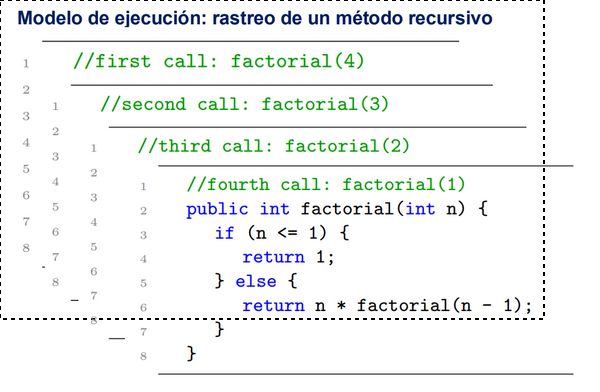

## Ejemplo de torres de hanoi
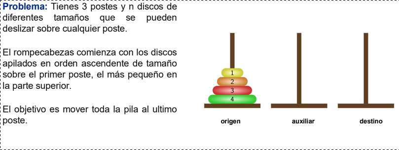

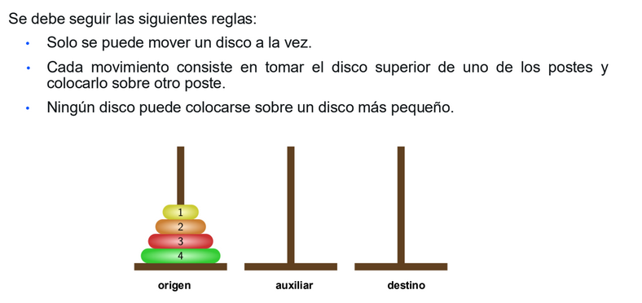

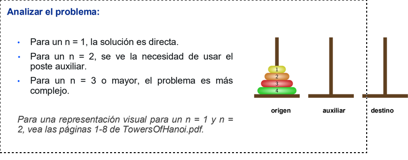

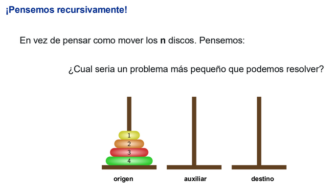

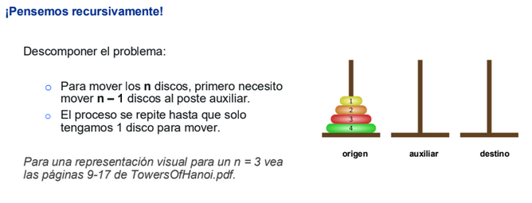

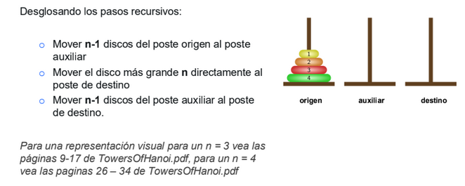

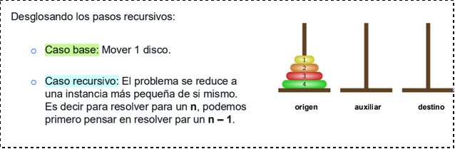

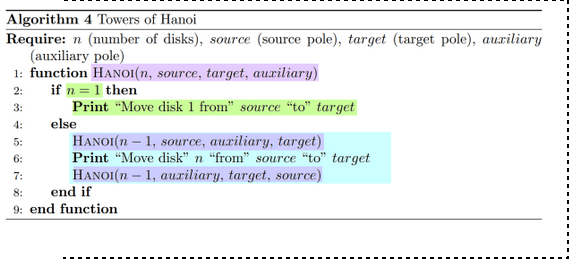