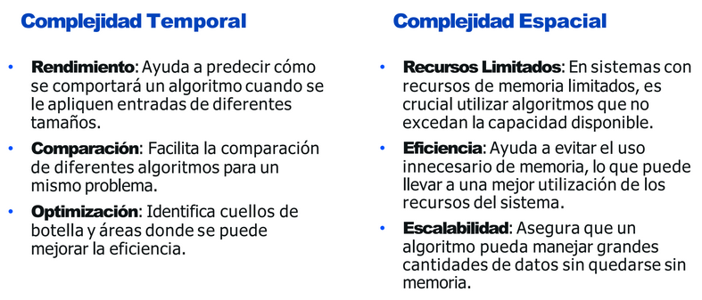
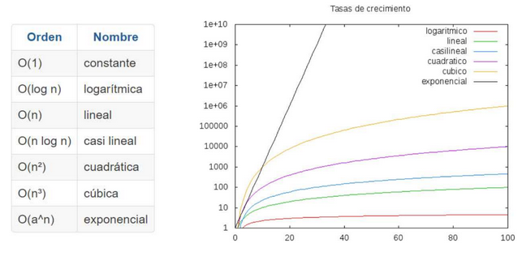
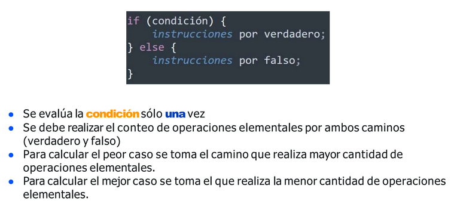
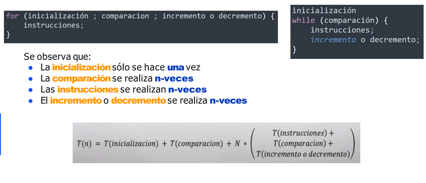

# Fundamentos de algoritmos - Parte 2 


Un problema es una situacion para ser resuelta y se define por:
- La especificacion de los datos de entrada
- La especificacion de lo que busca encontrar como salida
- Los problemas pueden ser de diversas naturalezas, como optimizacion, busqueda, ordenamiento, etc

Un correcto dominio del problema es esencial para el disenio y el analisis de algoritmos, ya que diferentes tipos de entradas pueden requerir enfoques algoritmicos para resolver el problema de manera eficiente


### Tamanio del problema
- Se refiere a una medida que cuantifica la dificultad del problema o la cantidad de recursos necesarios para resolverlos
- En este documento denotaremos el tamanio del problema como N

***Ejem:***
Dado un arreglo V de numeros enteros con N elementos, encontrar un numero X dato
N=9 X=7
v={5,8,10,1,2,7,4,6,12}

Cual es el tamanio del problema??
Dado a que debemos de recorrer todo el array para encontrar el numero, el tamanio del problema es la cantidad de elementos en el arreglo, en este caso N


***Ejem:***
Dada una matriz M de numeros enteros de F filas por C columnas se pide encontrar un numero X dado
F=3 C=5
M={[5,8,4,54,8],[3,56,3,54,2],[9,9,0,33,2]}
Cual es el tamanio del problema??
Dado a que debemos de recorrer toda la matriz, el tamanio del problema sera N=FxC


### Calculo de complejidad - Notacion Asintotia 
#### Complejidad Temporal  y Espacial
Que hace que un algortimo sea "Mejor" que otro?
***Ejem:***
Pongamos un ejemplo: Pedrito desarrolla un algoritmo que resuelve un problema en
20 segundos y que al procesarse ocupa 50mb de memoria en el procesador. Jaimito
desarrolla un algoritmo que resuelve el mismo problema en 50 segundos, sin
embargo este solo toma 10mb de memoria en el procesador.

Analizando el ejemplo anterior nos damos cuenta que se nos muestran 2 parámetros para cada algoritmo: el tiempo de ejecucióny la memoriaque este toma.

Es así que cuando hablamos del análisis de algoritmos diremos que la eficiencia de  los mismos se mide según estos dos parámetros.

Existen mas que se pueden tomar en cuenta, como ser:
- Facilidad de programarlo: Las estructuras usadas son básicas. 
- Corto: Que un programa resuelva el problema en 10 líneas y el otro en 40 líneas no significa que uno sea mas eficiente que el otro, ¿o si?.
    Entonces ¿Cómo sabemos cual de los dos algoritmos es mas eficiente?
- Fácil de entenderlo, robusto, etc.

De entre todos los posibles parámetros, la forma mas simple de determinar el concepto de “MEJOR” diremos que:
***“Un algoritmo es mejor mientras menos recursos consuma”***


***Complejidad Temporal***
Mide el tiempo de ejecucion de un algoritmo en funcion del tamanio de la entrada
- Se utiliza para describir como varia el tiempo de ejecucion a medida que cambia la cantidad de datos que el algoritmo debe procesar

***Complejidad Espacial***
La complejidad espacial mide la cantidad de memoria que un algoritmo necesita en funcion del tamanio de la entrada. Esto inluye tanto la memoria necesaria para almacenar los datos de entrada como cualquier espacio adicional que el algoritmo requiera durante su ejecucion 



### Notacion asintotica
Esta es una forma de describir el comportamiento de funciones cuando los argumentos tienden a ciertos limites, generalmente cuando el tamanio del argumento se hacen muy grande

Es una herramienta en el analisis de algoritmos, ya que permite comparar su eficiencia y rendimiento. Las tres notaciones mas comunes son:
- Omega (Ω)
- O grande (Big O) 
- Theta (Θ)


#### Notacion Omega (Ω)
Este es el ***mejor caso*** de una algoritmo, que corresponde a la taza del algoritmo que realiza menos instrucciones

Caracteristicas:
- Describe un limite inferior asintotico
- Indica el mejor caso de rendimiento

***Ejem:***
Dado el siguiente arreglo, se pide encontrar el valor 5. Cuantas consultas debera hacerse??
arr=[5,6,8,3,8,0,4,5,6,88,7,55]

Dado a que el valor inicial es el que estamos buscando, entonces basta con que haga una iteracion en el array, a lo mas una consulta, entonces el mejor caso en el problema de buscar un elemento buscado se encuentre en la primera posicion 

#### Notacion O grande (Big O)
Este es el ***peor caso*** de un algoritmo, y coresponde a la taza del algoritmo que realiza mas instrucciones 

Caracteristicas:
- Describe un limite superior asintotico
- Indica el peor caso de rendimiento
- Se ignora las constantes y terminos de menor grado

***Ejem:***
Dado el siguiente arreglo, se pide encontrar el valor 55. Cuantas consultas debera hacerse??
arr=[5,6,8,3,8,0,4,5,6,88,7,55]

Dado a que el valor que estamos buscando es el ultimo del arreglo, la busqueda debera llegar hasta el final del mismo para encontrarlo

Entonces el peor caso del problema de buscar un elemento en un arreglo llegaria a ser que el elemento buscado se encuentre en la ultima posicion 

#### Notacion Theta (Θ)
Este es el ***Caso promedio***, el cual corresponde a la taza del algoritmo que realiza un numero de instrucciones igual a la esperanza matematica de la variable aleatoria definida por todas las posiles tazas del algoritmo para un tamanio de la entrada dada

Carcateristicas:
- Describe un limite ajustado
- Indica el comportamiento promedio o el caso mas tipico

***Ejemp***
Dado el siguiente arreglo, se pide encontrar el valor 4. Cuantas consultas debera hacerse??
arr=[5,6,8,3,8,0,4,5,6,88,7,55]

Analizando el arreglo veremos que 2 es el valor de en medio del arreglo, así que el
algoritmo de búsqueda deberá llegar hasta la mitad del mismo para encontrarlo.
Generalizando: El caso promedio en el problema de buscar un elemento en un arreglo llegaría
a ser que el elemento buscado se encuentre en la posición de la mitad del arreglo.


### Analisis de un algoritmo
- Es necesario conocer la complejidad del problema que resuelve el algoritmo
- Conocer la dimension de la entrada (numero de elementos)
- Determinar el numero de operaciones a realizar


La complejidad de un algoritmo se representa a traves de una funcion matematica
Los ordenes de complejidad mas comunes en el analisis de algoritmos son:


OE = Operacion elemental es aquella que el ordenador realiza en tiempo acotado por una constante 

A la hora de medir el tiempo, siempre lo haremos en funcion del numero de operaciones elementales OE, que realiza el algoritmo

Que hay que considerar como operacion elemental??
- Operacion aritmeticas basicas
- Asignaciones a variables
- Llamadas a funciones y procedimientos
- Retorno o salida de datos
- Comparaciones Logicas
- Acceso a estrcuturas indexadas basicas, como son los vectores y matrices

El conteo se hara como: 1OE

### Metodo de conteo de Operacion - Calculo de T(n)
El método consiste en contar las operaciones elementales para determinar la
complejidad temporal de un algoritmo.

- Denotaremos T(n) la tiempo de ejecución de un algoritmo para una entrada de tamaño n.

Proceso:
1. Identificar las operaciones elementales en el algoritmo.
2. Contar cuántas veces se ejecuta cada operación elemental.
3. Expresar el total en función del tamaño de la entrada.


***Ejemplos:***





***Notas:***
- El análisis de algoritmos nos permite determinar la eficiencia de los mismos en función del tiempo y espacio, donde la mas importante es considerada la del tiempo.
- Para realizar el calculo de complejidad es  necesario tener ciertos conocimientos de
matemáticas tales funciones, series, etc. 
- La notación asintótica es la que nos permite determinar la eficiencia de los  algoritmos.

### Analisis de algoritmos - BigO para aloritmos recursivos 

Esta funcion calcula el año el cual la edad de limak sera mayor a la de bob, sin embargo, sabemos que aunque no es posible, es un buen ejemplo de recursividad.

Estas funcion recibe tres paremetros de entrada, el primero es la edad de limak, el segundo la edad de bobo y el tercero el contador de años.

Si la edad de limak es mayor a la de bob, regresaremos los años donde lo alcanza, de lo contrario, retornara la misma funcion, pero con los parametros iniciales manipulados, por lo que ahora en este punto la edad de limak se multiplicara por 3, la de bob por 2 y los años se sumara uno

```
    static int contarAnios(int limak, int bob, int anios){ 
	// limak = 4  SUPOSICION DE ENTRADA
	// bob = 7 SUPOSSICION DE ENTRADA
	// anios = 0 SUPOSISCION DE ENTRADA

        if(limak > bob){ // 1
            return anios; // 1
        }
        return contarAnios(limak * 3, bob * 2, anios + 1);


    SEGUNDA LLAMADA A LA FUNCION cuando Años=1
    // limak = 4 * 3
	// bob = 7 * 2
	// anios = 0 + 1
	
    TERCERA LLAMADA A LA FUNCION
	// limak = 4 * 3 * 3 
	// bob = 7 * 2 * 2
	// anios = 0 + 1 + 1
	
    CUARTA LLAMADA A LA FUNCION
	// limak = 4 * 3 * 3 * 3 
	// bob = 7 * 2 * 2 * 2
	// anios = 0 + 1 + 1 + 1
	
    QUINTA LLAMADA A LA FUNCION
	// limak = 4 * 3 * 3 * 3 * 3
	// bob = 7 * 2 * 2 * 2 * 2
	// anios = 0 + 1 + 1 + 1 + 1

    Como vemos, hay un patron aqui el cual lo sintetizaremos a lo siguiente
	// limak = 4 * 3 ^ i 
	// bob = 7 * 2 ^ i
	// anios = 0 + i

Suponiendo que en el año = 1
Año=1
3^i = 1 // lo igualamos a uno por que es cuando anos=1
log(3^i)=log1  //Propiedad de logaritmos
ilog3 = log1

Sin embargo, si queremos generalizar, cambiaremos anios=n, entonces:
Año=n
3^i = n // lo igualamos a uno por que es cuando anos=1
log(3^i)=logn  //Propiedad de logaritmos
ilog3 = logn
i = log n / log 3
i = log3(n) //donde 3 es el subindice de log
//HASTA AQUI HEMOS CUBIERTO EL ANALISIS DEL PRIMER CASO, DEL CASO DE LIMAK

Por lo tanto para el segundo caso haremos lo mismo, ya simplificado se vera como:
2 ^ i = n
i = log2(n) //donde 2 es un SUBINDICE, solamente esta n

Entonces, la suma de esta funcion recursiva sera:
t(n) = 10 + 1 + log3n + log 2 n + n
Por lo tanto, el peor caso sera O(n)

```


## Ver archivo ->  LeonardoEscobar-Lab2-Algoritmos1.pdf
