# Estartegia de algoritmos 

## Algoritmo de fuerza bruta (Brute force)
- Los algoritmos de fuerza bruta son una técnica de resolución de problemas que implica probar todas las posibles soluciones hasta encontrar la correcta. 
- Se basan en la evaluación exhaustiva de todas las opciones posibles.

***Ventajas:***
- Simplicidad:Su implementación es sencilla y fácil de entender
- Garantíadeoptimalidad:Si se completa la búsqueda, se encuentra la solución óptima
***Desventajas:***
- Ineficiencia:Puede ser extremadamente lento para problemas con un gran número de posibilidades
- Impracticidad: No es viable para problemas con espacios de búsqueda infinitos o muy extensos

Ejemplo:
Dado un numero N, contar la cantidad de divisores de N.
Recuerda: Un número es divisible por otro cuando el resultado de dividir el primer número entre el segundo es un número entero sin residuo

Ejemplo:
N = 15

Logica:
- Analizando veremos que el valor mas pequeño que puede dividir a 15 es 1
-  Y que cualquier valor superior a 15NO dividirá de forma exacta a 15,por lo cual el valor mas grande que podría dividir a 15de forma exacta es 15
-  Ahora, para aplicar nuestro algoritmo por fuerza bruta, probaremos cada uno de los valores en el rango de 1a 15,si el resultado de dividir N entre dicho valor es exacto entonces lo contaremos

Codigo: 
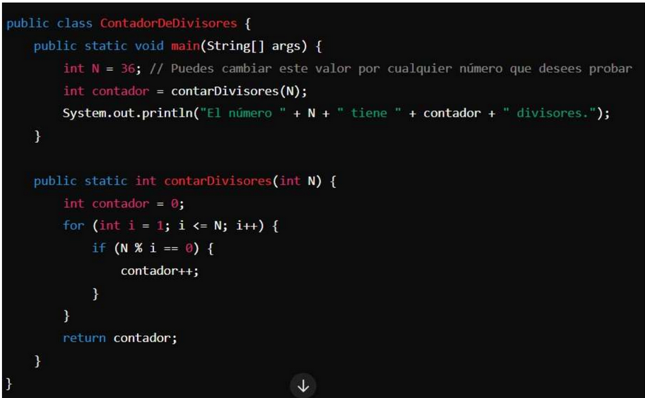

Complejidad: O(n)

Ahora, si queremos por ejemplo adivinar la clave de un cajero, debemos deusar un for para cada caracter como los siguientes codigos

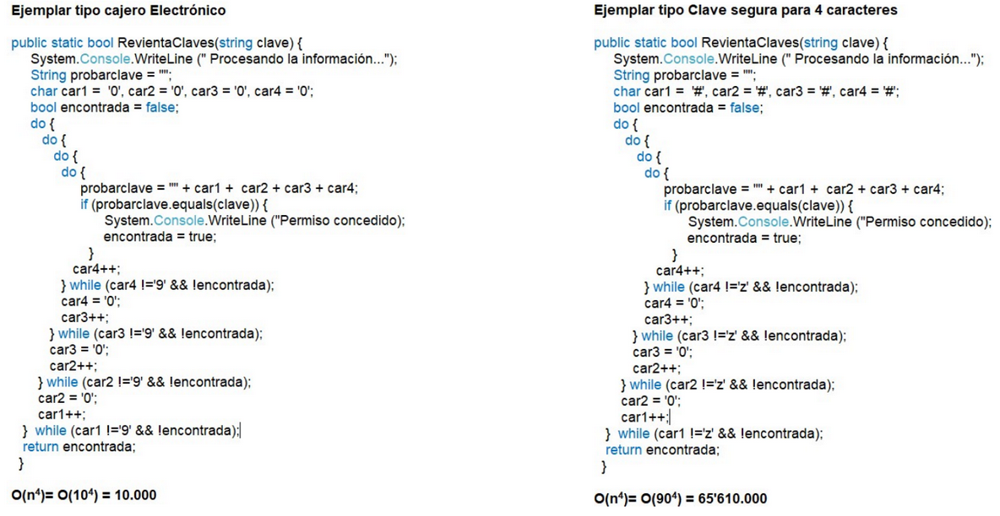

## Algoritmos voraces (Greedy)
- El algoritmo voráz, greedy o goloso es un método de búsqueda que toma
la mejor decisión local en cada paso para construir una solución global. 
- Funciona de manera similar a comerse un pastel, tomando la porción más
grande en cada bocado hasta que se termina.

***Ventajas:***
- Es generalmente más rápido y eficiente que la fuerza bruta. • Puede ser útil para encontrar soluciones aproximadas a problemas complejos
***Desventajas:***
- No garantiza encontrar la solución óptima. 
- Puede quedar atrapado en soluciones locales óptimas que no son la mejor solución global. 
- Es difícil demostrar su correctitud,

Diremos que es un tipo  algoritmo greedy CUANDO, en cada paso elige la mejor solucion local

NOTA: Por lo general es difícil probar que una solución greedy resuelve el problema en su totalidad

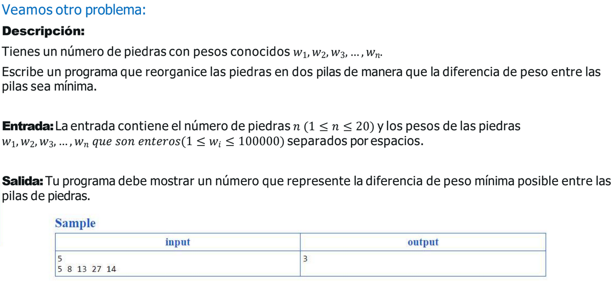

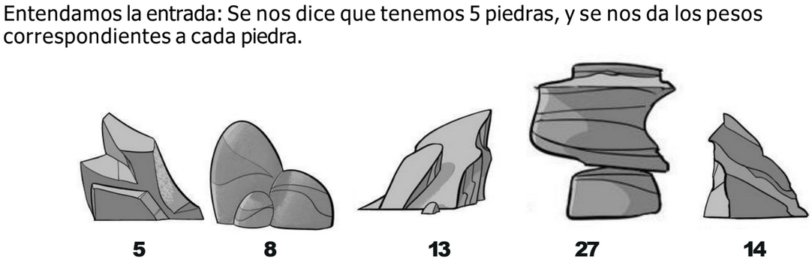

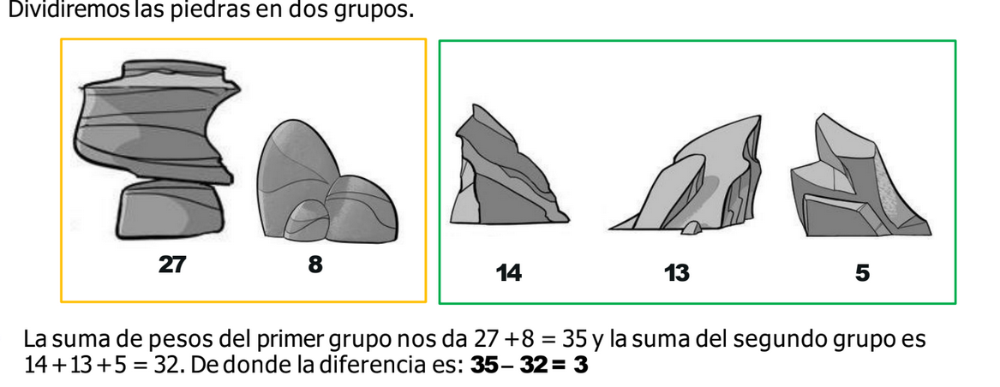

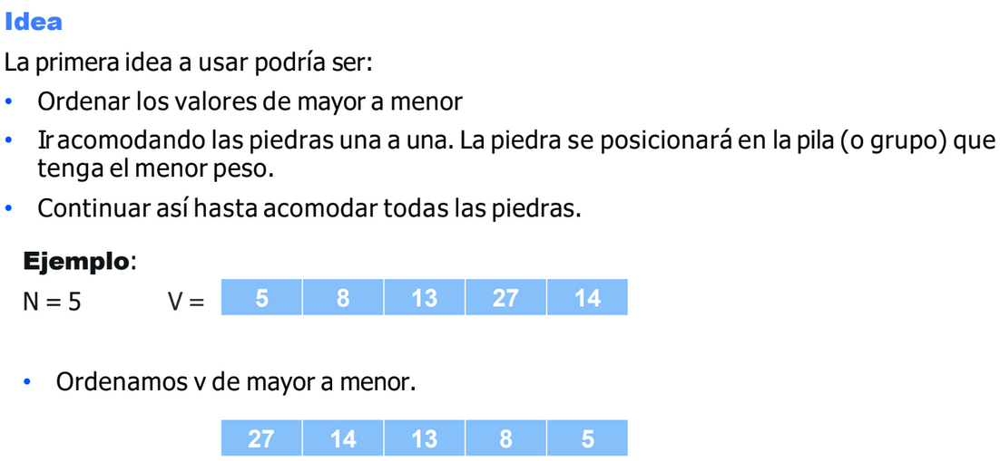

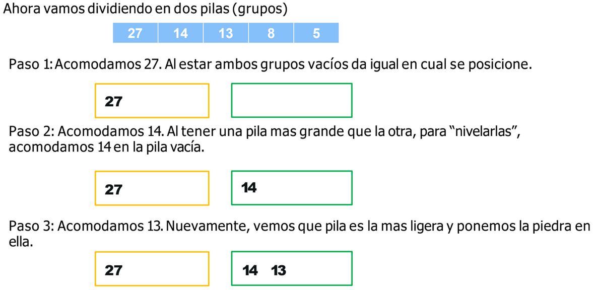

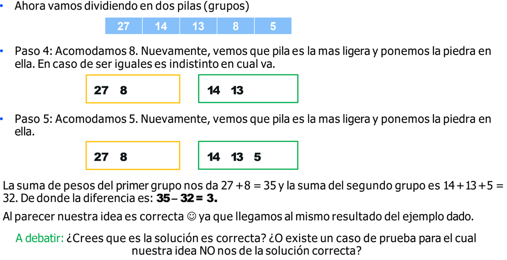

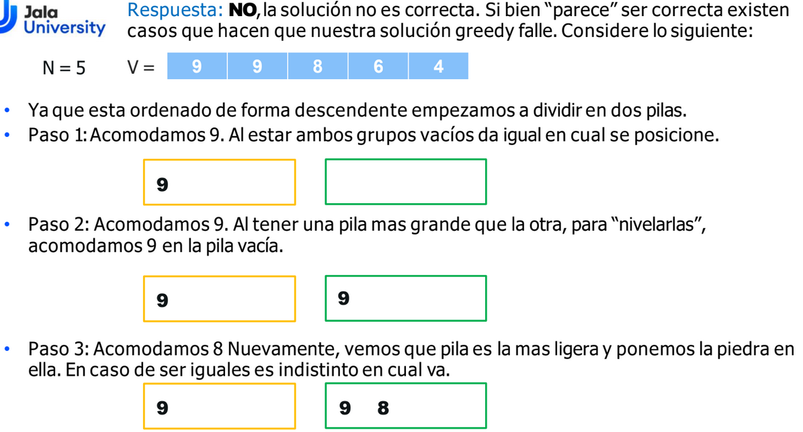

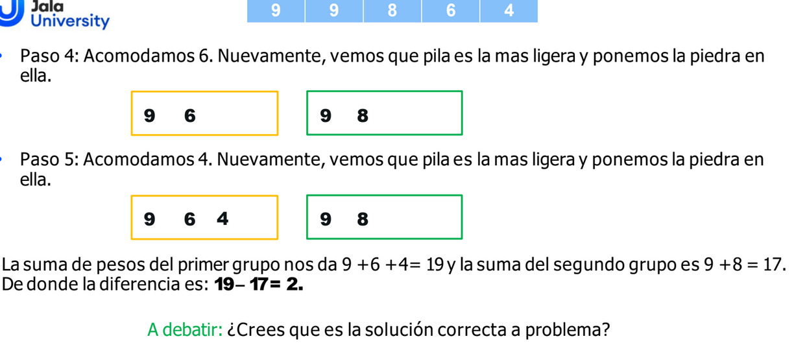

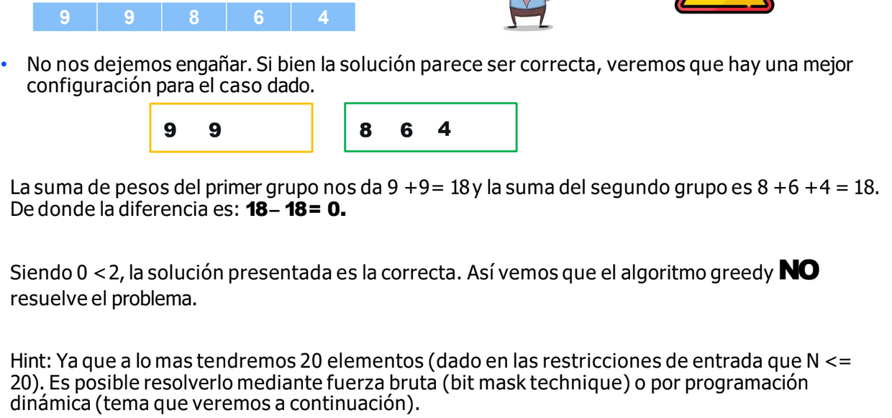

Para tener en cuenta:
- Es conveniente verificar que el problema exhiba la optimal-substructure property antes de intentar pensar una estrategia greedy. 
- Una idea greedy puede llegar a ser fácil de implementar, pero puede fallar.

## Divide y venceras (Divide and conquer)
Divide y vencerás es una técnica que divide un problema en subproblemas más
pequeños, los resuelve de manera recursiva y combina sus soluciones para  esolver el problema original.

- Descomposición de Problemas:
Divide un problema en dos o más subproblemas independientes, resuelve cada subproblema de manera recursiva y combina sus soluciones para resolver el problema original. 

- IndependenciadeSubproblemas:
Los subproblemas deben ser independientes, es decir, resolver uno no debe afectar la resolución de los otros

¿Como funciona?
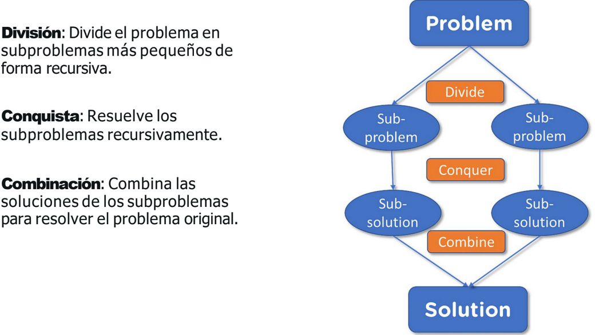

***Ventajas***
- Modularidad: Descompone problemas complejos en partes más manejables. 
- Optimización:Mejora el rendimiento en problemas específicos. 
- ProcesamientoenParalelo: Los subproblemas independientes pueden ejecutarse en paralelo. 
- Escalabilidad: Se adapta bien a sistemas multi-hilo.

***Desventajas***
- Uso de Memoria:Puede consumir mucha memoria debido a las llamadas
recursivas.
- StackOverflow:Riesgo en problemas con gran profundidad de recursión. 
- Equilibrio: La eficiencia depende de divisiones equilibradas.   
- Elección de Pivotes: Una mala elección puede degradar el rendimiento (e.g.,
Quick Sort). 
- ComplejidadInicial: Implementaciones eficientes pueden ser complejas

Ejemplo:
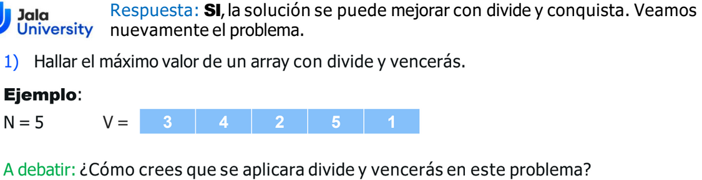

Logica 
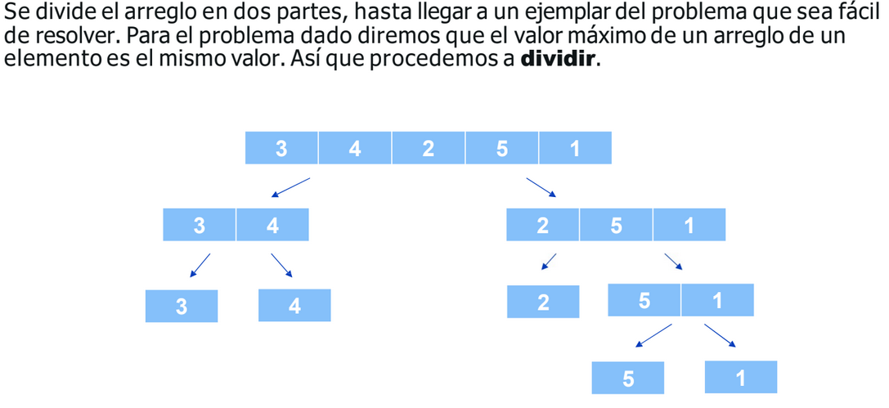

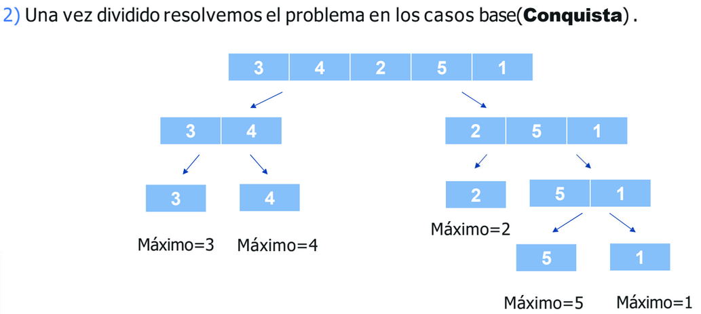

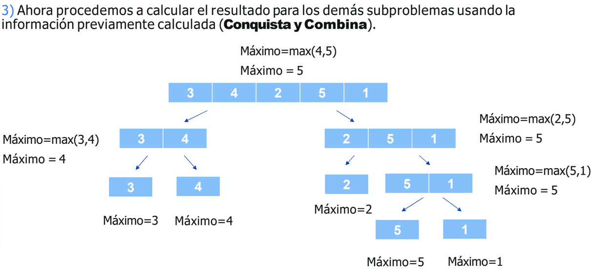

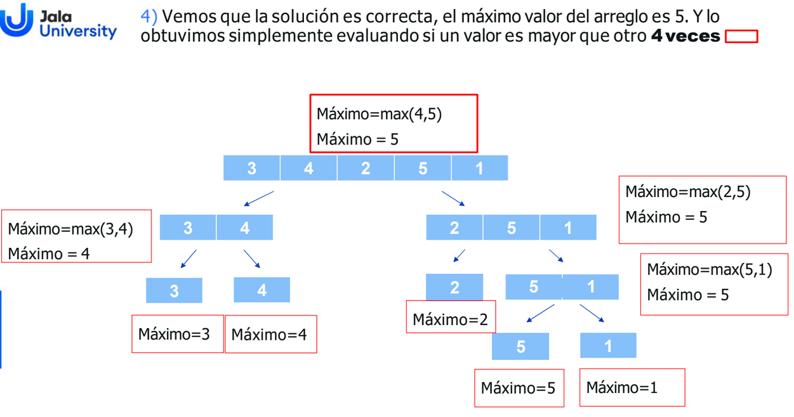

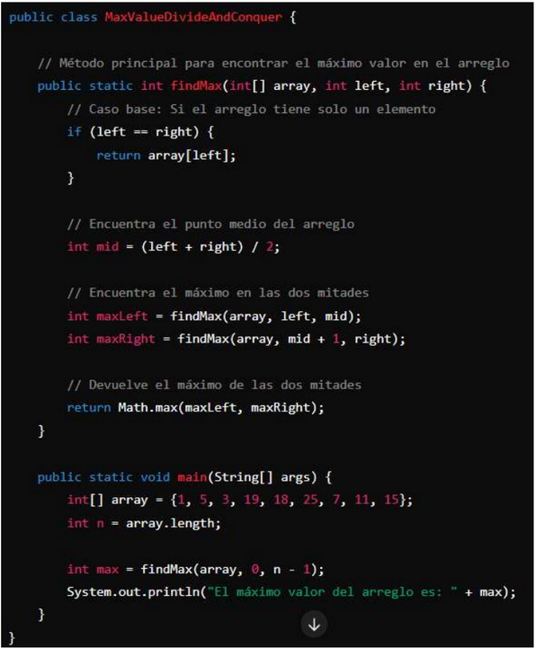

Analisis de complejidad
Si bien la cantidad de evaluaciones de si un numero es mayor a otro se
realiza muy pocas veces, el caso base llega a cada elemento del arreglo. De
modo que la complejidad del algoritmo es lineal O(N).

Si hubieramos hecho este ejercicio con fuerza bruta la complejidad del problema hubira sido O(n²), por lo que este metodo de divide y venceras ayudo a reducir la complejidad del codigo

Condiciones para usar este metodo:
- El problema debe poder dividirse en subproblemas más pequeños del mismo tipo. - Los subproblemas deben ser independientes, es decir, resolver uno no afecta a los otros. 
- Debe ser posible combinar las soluciones de los subproblemas para resolver el
problema original. 
- La división debe reducir significativamente el tamaño del problema, segurando que se resuelva en un número logarítmico de pasos. 
- El problema debe tener casos base bien definidos que puedan resolverse directamente sin necesidad de más divisiones.

---
Resumen 
Fuerza bruta (brute force):
        Búsqueda exhaustiva a través de todas las soluciones posibles.

Algoritmos codiciosos (Greedy):
        Muestran cómo tomar decisiones localmente óptimas en cada etapa.
        Características: No garantiza una solución óptima, pero a menudo proporciona una buena.

Dinámico
        Muestran cómo tomar decisiones localmente óptimas en cada etapa.
        Características: No garantiza una solución óptima, pero a menudo proporciona una buena solución.

Divide y vencerás:
        Dividir un problema en subproblemas más pequeños, resolver recursivamente y combinar soluciones.
        Características: Dividir, conquistar y combinar pasos.
        Resolver problemas complejos dividiéndolos en subproblemas superpuestos.
