# Algoritmos de ordenacion 

Un algoritmo de ordenacion es un metodo para reordenar la lista de elementos en un cierto orden, tipicamente orden numerico o lexicografico 

Orden numerico: Secuencia en la cual los numeros se organizan de acuerdo con su valor

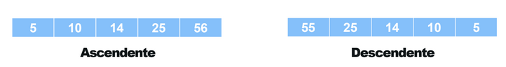

Orden lexicografico: Es la secuencia en la que ordenan cadenas de carcateres (como palabras) basandose en el orden alfabetico de sus componentes
Es similar a como las palabras se ordenan en un diccionario
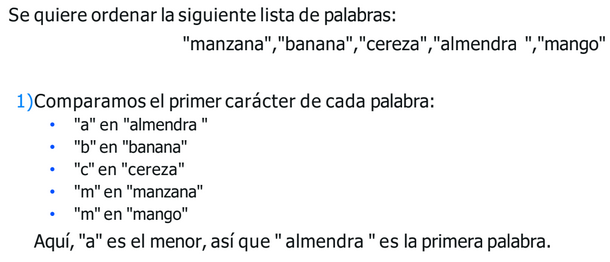

### Aplicaciones de ordenacion 
- **Busquedas eficientes**: Permite busquedas rapidas usando busqueda binaria
- **Procesamiento de Datos**: Facilita el analisis y la visualizacion de datos y el calculo de medianas y percentiles
- **Bases de datos**: Mejora el rendimiento de consultas y optimiza operaciones de join en SQL
- **Optimizacion de algoritmos**: Hace mas eficientes los algoritmos de combinacion de listas y geometricos 
- Y muchas mas...

### Algoritmos de ordenacion 
## Algoritmo de fuerza bruta (Bubble sort)
Bubble Sort es un algoritmo de ordenación simple que recorre repetidamente la lista, compara elementos adyacentes y los intercambia si están en el orden incorrecto.
Este proceso se repite hasta que la lista está ordenada.

**Ventajas**:
- Simple de entender e implementar
- No requiere memoria adicional significativa

**Desventajas**: 
- Muy ineficiente para listas grandes
- Realiza muchas comparaciones e intercambios

**Logica**:
- Se recorre de izquierda a derecha comparando los elementos adyacentes y el mayor se coloca a la derecha. 
- De esta manera, el elemento más grande se mueve al final derecho primero. 
- Este proceso se continúa para encontrar el segundo más grande y colocarlo, y así sucesivamente hasta que los datos estén ordenados.

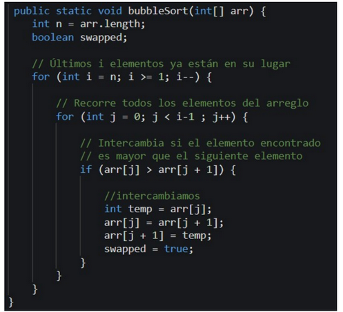

**Complejidad**:
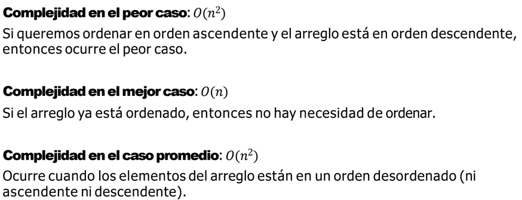

**Simulacion**:
https://anim.ide.sk/sorting_algorithms_1.php

## Algoritmo Counting sort
Counting Sort es un algoritmo de ordenación nocomparativoque cuenta el
número de ocurrencias de cada valor en la lista y usa esa información para
colocar cada valor en la posición correcta. (Otros algoritmos similares son: Radix sort y Bucket sort)

**Ventajas**:
- Muy eficiente para listas con un rango limitado de valores. 
- Lineal en tiempo de ejecución para ciertos casos.

**Desventajas**: 
- No es adecuado para listas con un rango de valores muy grande.
- Requiere memoria adicional proporcional al rango de valores.
-  Los valores deben ser positivos, el algoritmo no funciona con valores negativos.

**Logica**:
1) Hallar el máximo valor del arreglo (Se lo encuentra en O(n) tomando el primer valor como máximo y recorriendo el vector consultando si el elemento visto es mayor al actual mayor, de ser así, el mayor se actualiza al valor del arreglo.)
2) Crea un nuevo array para contar cuántos elementos hay de los diferentes valores. Lo
llamaremos count e iniciaremos los valores en cero hasta la posición del valor máximo.
3) Recorre el array que necesita ser ordenado.
4) Para cada valor, cuéntalo incrementando el array de conteo count en el índice
correspondiente.
5) Después de contar los valores, recorre el array de conteo count para crear el array
ordenado.
6) Para cada valor en el array de conteo, crea el número de elementos igual al valor
almacenado en count, con valores que correspondan al índice del array de conteo count.

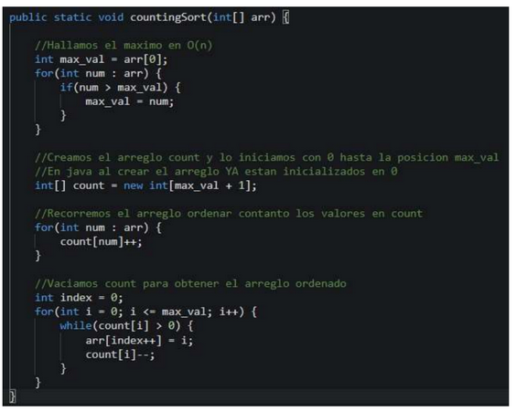

**Simulacion**:
https://visualgo.net/en/sorting

**Complejidad**:

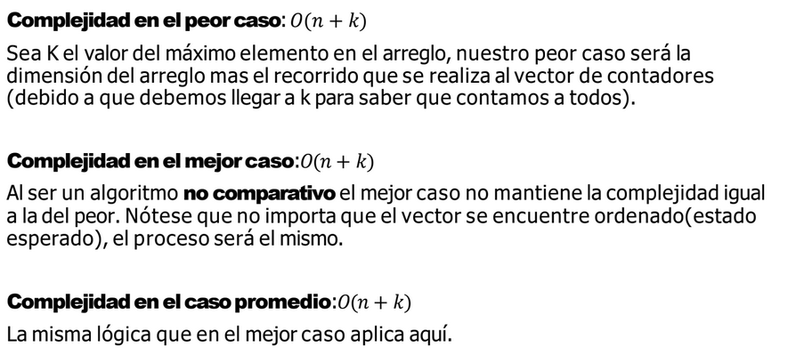

## Algoritmo Insertion sort
El ordenamiento por inserción es un algoritmo sencillo y estable que organiza elementos al insertarlos iterativamente en su posición correcta dentro de una lista ya ordenada. • Es similar a ordenar cartas en la mano: separamos las cartas en ordenadas y desordenadas, y vamos colocando cada carta desordenada en su lugar correcto dentro del grupo ordenado.

**Ventajas**:
- Simple de implementar. 
- Eficiente para listas pequeñas o casi ordenadas. 
- Ordenación en el lugar (in-place) y estable.

**Desventajas**: 
- Ineficiente para listas grandes.
- Realiza muchas comparaciones e intercambios en el peor caso.

**Logica**:
1) Comenzarconelsegundoelemento: El primer elemento del arreglo se asume que está
ordenado.
2) Compararyordenar: Compara el segundo elemento con el primero. Si es menor,
intercámbialos.
3) Avanzaraltercerelemento:Compara el tercer elemento con el segundo y luego con el
primero. Intercambia según sea necesario para colocarlo en la posición correcta entre los
tres primeros elementos.
4) Repetirelproceso: Continúa comparando cada nuevo elemento con los anteriores y
realizando los intercambios necesarios para colocarlo en su posición correcta.
5) Finalizar: Repite estos pasos hasta que todo el arreglo esté completamente ordenado.

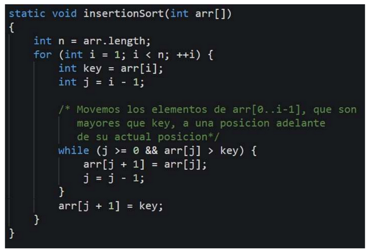

**Simulacion**:
https://visualgo.net/en/sorting?slide=1

**Complejidad**:
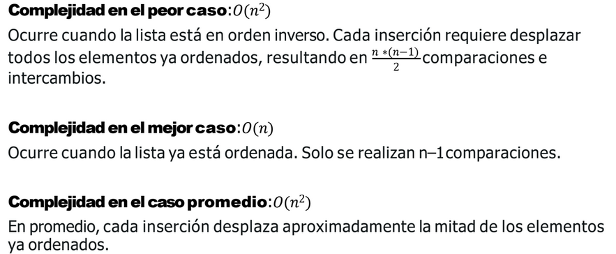

## Algoritmo Merge sort
Merge Sort es un algoritmo de ordenación que usa la técnica divide y vencerás, este divide la lista en dos mitades, las ordena recursivamente y luego las mezcla para así finalmente obtener la lista ordenada en su totalidad.

**Ventajas**:
- Muy eficiente y estable
- Rendimiento garantizado de O(n logn)

**Desventajas**:
- Uso adicional de memoria para las sublistas temporales
- Puede ser mas lento que otros algoritmos O(n logn) en la practica debido a la sobrecarga de recursion 

**Logica**:
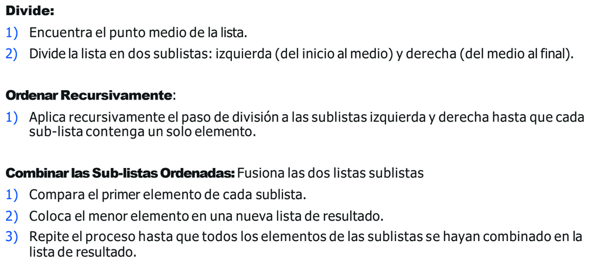

Codigo: 
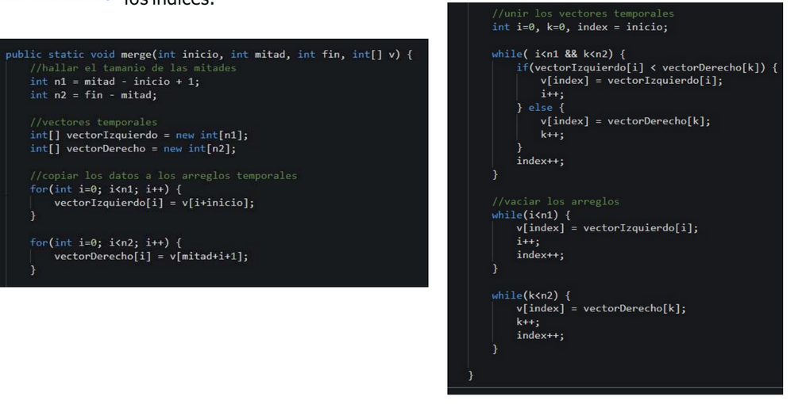

**Simulacion**:
Solo usa un arreglo auxiliar

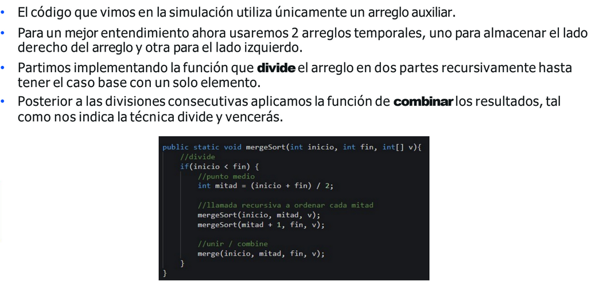

https://anim.ide.sk/sorting_algorithms_2.php 

**Complejidad**:
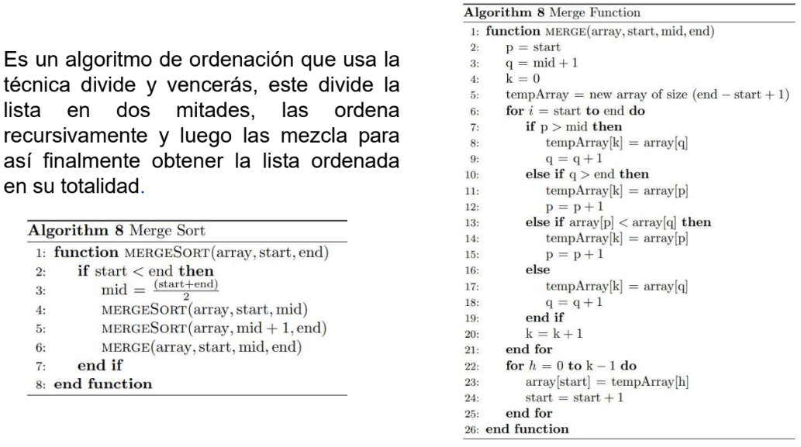

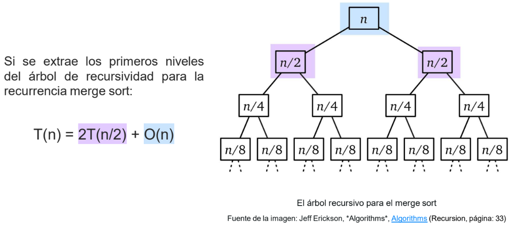

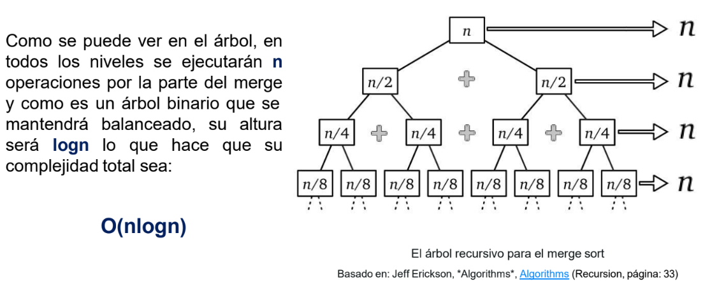

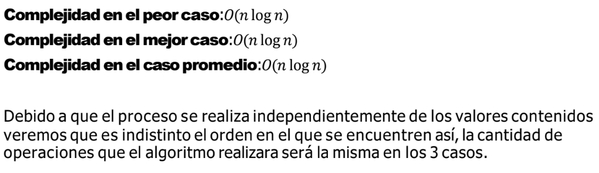

## Algoritmo Quick sort
Quick Sort es un algoritmo de ordenación que utilizas la técnica divide y vencerás. • Este selecciona un "pivote" y reordena la lista de modo que todos los elementos menores que el pivote queden a la izquierda y los mayores a la derecha, luego aplica el mismo proceso recursivamente a las sublistas.

**Ventajas**:
- Muy rapido y eficiente en la practica
- Ordenacion en lugar (in-place)

**Desventajas**:
- Rendimiento dependiente de la eleccion del pivote
- Peor caso O(n²) aunque es raro
- No es estable 

**Logica**:
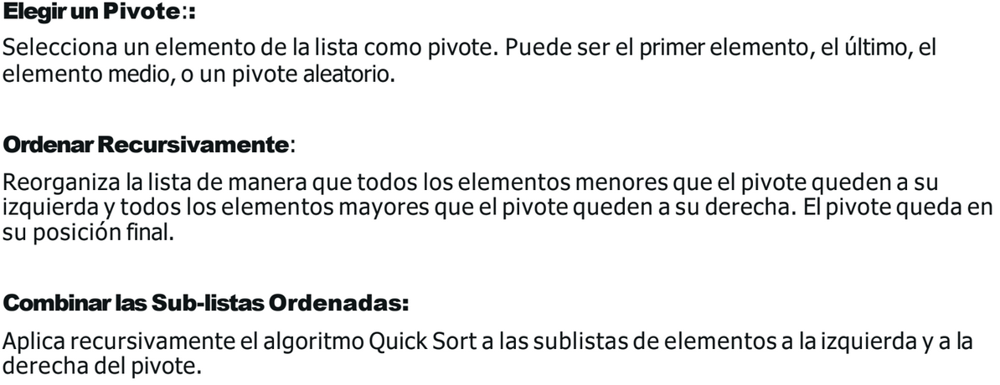

Codigo: 
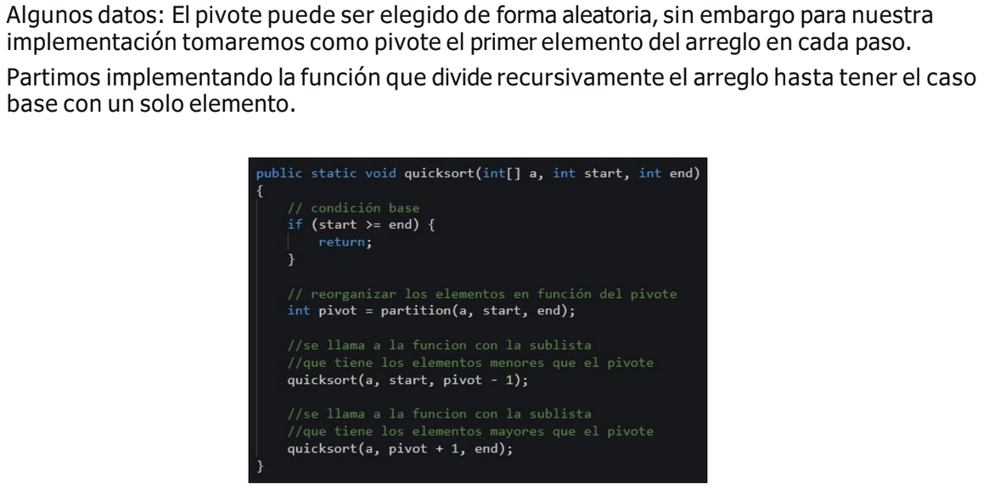
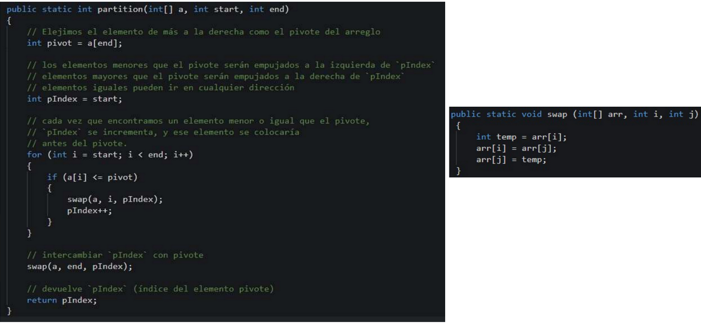

**Simulacion**:
https://anim.ide.sk/sorting_algorithms_2.php

**Complejidad**:
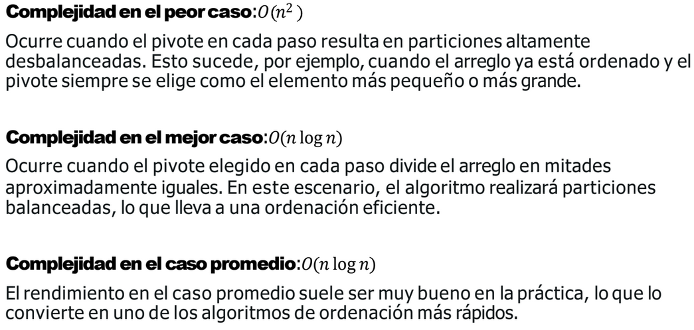

## Resumen
- Bubble sort: Simple pero ineficiente para grandes conjuntos de datos
- Counting sort: Ideal para rangos limitados de valores con complejidad lineal
- Insertion Sort: Eficaz para listas pequeñas o casi ordenadas
- Mergue sort: Garantiza un rendimiento O(n logn), aunque requiere memoria adicional
- Quick Sort: Rapido en la practica O(n logn), pero cuidado con el peor caso
